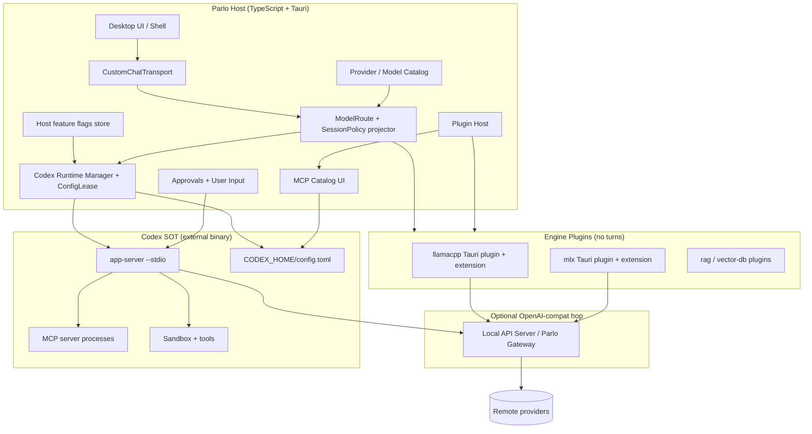
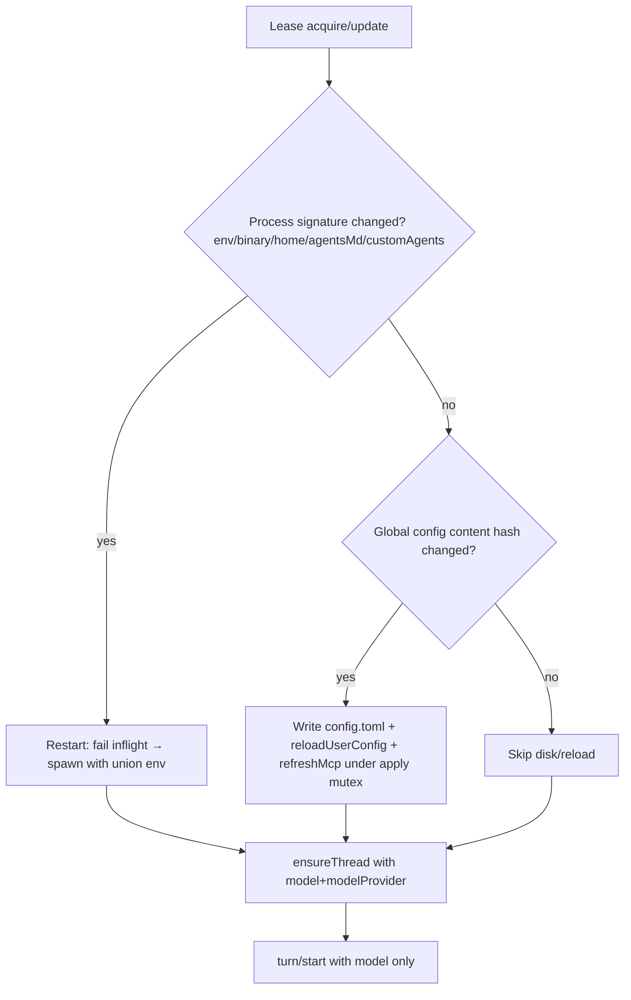
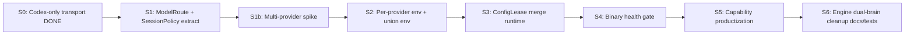

# Design: Parlo as Codex CLI Host (Codex as Source of Truth)

| Field | Value |
|-------|-------|
| **Document** | `DESIGN_CODEX_HOST.md` (landing path: repo root or `docs/` when committed) |
| **Author** | TBD |
| **Date** | 2026-07-08 |
| **Status** | Accepted (rev 4 — open questions OQ1/OQ2/OQ5 resolved by product; landed as PR1) |
| **Scope** | Architecture + migration for durable Codex-SOT host model |
| **Primary write path** | `/tmp/grok-design-doc-51be0012.md` |
| **Recommended repo path** | `/Users/conrad/Documents/GitHub/Parlo/DESIGN_CODEX_HOST.md` (or `docs/architecture/DESIGN_CODEX_HOST.md` once a `docs/` tree exists) |

---

## Overview

Parlo is a full desktop **host wrapper** around OpenAI Codex CLI / app-server. Codex is the **Source of Truth (SOT)** for the agent runtime: the agent loop, tool execution, sandbox, MCP process spawning, thread/turn semantics, interrupt/compact/rollback, and stream event production. Parlo does **not** reimplement the agent brain.

Parlo owns everything the user experiences as product surface: UI/shell, workspace selection, approvals and user-input dialogs, provider/model catalog, `CODEX_HOME` / `config.toml` projection, local engine lifecycle (llamacpp, mlx), plugin host services (RAG, vector-db, download), and binary health. Every chat turn already flows:

```
UI → CustomChatTransport → sendCodexAppServerChatMessage → Codex app-server → model endpoint → events → ui-stream → UI
```

This design hardens that contract so **any** model Parlo can select is usable through Codex, unifies routing paths that today fragment across profile / direct / gateway, and makes concurrency, config lifecycle, binary pinning, and plugin boundaries durable enough for multi-chat production use.

**Rev 2 focus:** make ConfigLease, provider binding (thread vs turn), ModelRoute decision trees, env-union rollout, feature-flag host, multi-provider verification, and `prepareThreadCodexRuntime` implementation contracts **implementable** — not aspirational.

**Rev 3 focus:** single runtime mutation chain (no dual `applyChain`/`ensureChain` race); fully specified gateway collapse when `preferGatewayForRemotes`; normative env-flag truth table; in-flight abort mechanism; binary health step 0 on send; Local API “running” predicate.

**Rev 4 focus:** product resolutions for OQ1 (soft-warn pin default), OQ2 (direct remotes default), OQ5 (full RPC facade product-visible; PR8 is barrel reorg only).

---

## Background & Motivation

### Current state (audited, 2026-07)

| Layer | Location | Role today |
|-------|----------|------------|
| Chat transport | `web-app/src/lib/custom-chat-transport.ts` | Single path: always Codex app-server |
| Session/options/approvals/capabilities | `web-app/src/lib/codex-app-server/chat-backend.ts` (~2712 LOC) | Builds session options, bridges approvals, and holds most capability wrappers re-exported by `index.ts` (~165–180 RPC/CLI helper re-exports, not 180 modules) |
| Shared process | `web-app/src/lib/codex-app-server/global-codex-runtime.ts` | One global app-server; **spawn** serialized on `ensureChain`; process signature restart; runtime apply via disk write + reload (**apply is not on `ensureChain` today**) |
| Config TOML | `web-app/src/lib/codex-app-server/config.ts` | `buildCodexConfigToml` (already accepts `providers[]`), `buildCodexSpawnCommand` (`app-server --stdio`), `buildThreadStartParams` (`model` + `modelProvider`) |
| MCP bridge | `web-app/src/lib/codex-app-server/mcp-config-bridge.ts` | Parlo MCP → Codex `[mcp_servers.*]`; host tool proxy OFF |
| RPC client | `client.ts` / `json-rpc.ts` / `api.ts` | `thread/start`\|`resume` use `buildThreadStartParams` (includes `modelProvider`); **`turn/start` passes `model`, `cwd`, `approvalPolicy` — not `modelProvider`** |
| UI stream | `ui-stream.ts` | Codex events → AI SDK `UIMessageChunk` |
| Process I/O | `tauri-process.ts` + `src-tauri/.../studio/commands.rs` | spawn/stdin/stdout/stop, write config, CLI subcommands; binary fallback Codex.app / npx |
| Bootstrap | `CodexAppServerBootstrap.tsx` | Starts local API server + global Codex at app load; failures currently `console.error` only |
| Wire API map | `provider-gateway.ts` | Shared chat vs responses; `GATEWAY_SKIP_PROVIDERS` = `llamacpp`, `mlx`, `codex` |
| Local engines | extensions + Tauri plugins (llamacpp, mlx) | Prepare model + local OpenAI-compat API before turn |
| Profiles | `codex-provider-profile-store.ts` | **Global** `activeProfileId` (not per-thread); advanced overlay (baseUrl, sandbox, AGENTS.md, agents, snippet, optional `codexHome`) |
| Thread rebind | `client.ts` `ensureThread` | Binds via `loadedGeneration === manager.generation`; generation bumps on process restart |

Supporting tests and smoke: vitest under `codex-app-server/__tests__/`, `scripts/codex/*` (incl. `method-surface-check.mjs`), `scripts/codex-smoke-test.mjs`, yarn scripts `codex:parity:*`. **GitHub workflows do not currently run method-surface checks** (only local/preflight scripts). Older planning docs (`CODEX_CLONE_DELIVERY_PLAN.md`, `CODEX_CLONE_PARITY.md`) are partially stale relative to the single-path transport.

### Pain points

1. **Config races**: one shared app-server and one global `CODEX_HOME/config.toml`. Concurrent threads with different models/providers rewrite the same file and call `reloadUserConfig` — last writer wins; in-flight turns can observe the wrong **default** top-level config (per-thread provider binding is only at `thread/start`|`resume`).
2. **Apply is unguarded**: only `ensureGlobalCodexAppServer` uses `ensureChain`; `applyCodexRuntimeOptions` can interleave writes/reloads across threads.
3. **Signature gap**: process restart keys on binary/home/env/agentsMd/customAgents (`buildCodexProcessSignature`); model/provider/configToml apply via reload only (`buildCodexRuntimeSignature`). Env-key changes restart the **entire** global process (clears all thread runtime signatures).
4. **Routing complexity**: three overlapping paths — active Codex profile, direct provider projection (`buildCodexSessionOptions`), and Parlo Gateway fallback (`buildParloGatewayCodexConfig` when provider is bare `codex` without profile).
5. **Capability sprawl**: `index.ts` re-exports ~165–180 thin RPC/CLI helpers. Useful for parity/debug, not productized.
6. **Binary dependency**: PATH `codex`, macOS Codex.app, and `npx @openai/codex` fallbacks in Rust. No first-class pin/version gate; bootstrap swallows start failures.
7. **Dual-brain residue**: `AIEngine` / extension engines still exist for model **load/serve** (correct); engines must never send turns.
8. **Upstream method drift**: thin string RPC + three entries in `method-aliases.ts`.

### Why now

Chat already is Codex-only. The remaining work is to make the host contract **correct for every routed model**, **safe under concurrency**, and **clear for plugins** so Parlo can ship as “Codex desktop host with Parlo workspace/UI/engines” rather than a partial clone or dual product.

---

## Goals & Non-Goals

### Goals

1. **Codex SOT, durable**: agent loop, tools, sandbox, MCP execution, thread/turn, interrupt/compact/rollback stay in Codex forever.
2. **Universal model routing**: any Parlo-selected model projects to a Codex `model_provider` + env so app-server can call it.
3. **Host duties only in Parlo**: UI, workspace, approvals, user-input, catalog, config projection, engine prep, plugin UI/services.
4. **Plugin boundary**: plugins prepare backends / contribute MCP packs / UI panels; never call `turn/start` themselves.
5. **Config/env lifecycle** correct under multi-chat and multi-model use, with an **implementable** lease state machine and global apply mutex.
6. **Binary pin + health gate** before product features depend on app-server; failures visible before send.
7. **Incremental migration** without a big-bang rewrite.
8. **MCP ownership**: Parlo curates; Codex executes.
9. **Early multi-provider proof** before shipping merge runtime (spike + acceptance tests).

### Non-Goals

- Reimplementing Codex agent internals in Parlo or Rust.
- Removing Codex CLI / app-server.
- Making Extension `AIEngine` a second chat brain.
- Full productization of every Codex RPC in one release (capability surface is staged).
- Multi-tenant remote hosting (design is local desktop).
- Guaranteeing Codex upstream API stability (we adapt via pin + method aliases + parity scripts).
- Per-thread active Codex profiles in v1 (profile remains **global**; see KD17).

---

## Proposed Design

### 1. Layered architecture



**Ownership table**

| Concern | Owner | Implementation notes |
|---------|-------|----------------------|
| Agent loop / tools / sandbox | Codex | Never reimplemented |
| Thread/turn lifecycle | Codex | Parlo maps Parlo threadId ↔ codexThreadId (`codex-thread-persistence.ts`) |
| **Provider binding** | Codex at **thread/start\|resume** | `buildThreadStartParams` includes `model` + `modelProvider`. **`turn/start` does not pass `modelProvider`** (verified in `client.ts`) |
| Model id on subsequent turns | Codex via `turn/start.model` | May change model **id** on same thread; **provider** stays at thread bind unless rebind |
| Chat send path | Parlo transport → Codex | `CustomChatTransport` → `sendCodexAppServerChatMessage` |
| Model catalog & selection | Parlo | `useModelProvider` |
| Projection to Codex provider | Parlo | **`ModelRoute` + `SessionPolicy`** (new; consolidates `buildCodexSessionOptions`) |
| Local engine start | Parlo plugins | `ensureCodexTargetProviderReady` / `serviceHub.models().startModel` |
| MCP server list | Parlo | `useMCPServers` |
| MCP process spawn & tool call | Codex | Via projected `[mcp_servers.*]` |
| Approvals UI | Parlo | `useRuntimePermission`, `useCodexUserInput` |
| Binary spawn / stdio | Tauri Rust | `start_codex_app_server`, stdin write, line events |
| Native inference | Tauri plugins | llamacpp, mlx, hardware |
| RAG / vector index | Plugins | Prepare context/MCP; do not stream chat |
| Feature flags | Parlo host store | See § Feature flags (no existing multi-provider flags today) |

### 2. Universal model routing

Every selected Parlo model must become a **`ModelRoute`** (endpoint projection) plus a **`SessionPolicy`** (sandbox/approvals/agents — process-global or profile-scoped) before a turn starts.

```ts
// web-app/src/lib/codex-app-server/model-route.ts
export type CodexWireApi = 'chat' | 'responses'

/** Endpoint + auth projection for one Parlo-selected model. Concurrent-safe when merged. */
export type ModelRoute = {
  parloProviderId: string
  /** Codex [model_providers.<id>] key — reserved ids get Parlo- prefix */
  codexProviderId: string
  modelId: string
  baseUrl: string
  wireApi: CodexWireApi
  apiKeyEnvVar?: string
  apiKey?: string
  modelReasoningEffort?: 'none' | 'minimal' | 'low' | 'medium' | 'high'
  modelContextWindow?: number
  requiresLocalEngine: boolean
  /** Result of gateway decision tree (not a free preference) */
  useGateway: boolean
  source: 'direct' | 'profile' | 'gateway' | 'local-engine'
  /** Auth provenance for debug/tests */
  authSource?: 'api-key' | 'xai-oauth' | 'profile-mapped' | 'local-api' | 'none'
}

/**
 * Process-global / profile policy fields. NOT multi-valued across leases.
 * Concurrent threads share one policy snapshot (active global profile or defaults).
 */
export type SessionPolicy = {
  approvalPolicy: 'untrusted' | 'on-failure' | 'on-request' | 'never'
  sandbox: 'read-only' | 'workspace-write' | 'danger-full-access'
  permissionProfile?: string
  agentsMd?: string
  customAgents?: CodexSessionOptions['customAgents']
  advancedConfigSnippet?: string
  subagentMaxThreads?: number
  subagentMaxDepth?: number
  addDirs?: string[]
  codexBinaryPath?: string
  /** Always the app shared home for the global process — see KD18 */
  codexHome: string
}
```

#### 2.1 Gateway vs direct decision tree (normative, ordered)

Evaluate top-to-bottom; first match wins:

```
1. If parloProviderId ∈ GATEWAY_SKIP_PROVIDERS (llamacpp, mlx, codex):
     - If parloProviderId === 'codex' AND no active Codex profile:
         → apply GatewayCollapse (same as bare-codex today; see §2.1.1)
     - Else if local engine (llamacpp|mlx):
         → useGateway = false, source = 'local-engine',
           codexProviderId = 'llamacpp' | 'mlx' (distinct; not Parlo-gateway)
           baseUrl = buildLocalApiBaseUrl(localApi)
           wireApi = 'chat'
           apiKeyEnvVar / apiKey from local API key if set
           modelId = bare selected model id (no formatGatewayModelId)
     - Else (codex + active profile): fall through to profile branch (step 2)

2. If activeProfileId is set (global store):
     → useGateway = false, source = 'profile'
     → baseUrl = profile.baseUrl; providerType → codexProviderId via mapProfileProviderType
     → apiKey from mapped Parlo provider (or profile apiKeyEnv name only)
     → wireApi = gatewayWireApiForProvider(mapped target)
     → modelId = profile.model.trim() || selected model (with xAI remaps if applicable)

3. Else if host flag `preferGatewayForRemotes` is true
   AND localApiServerIsReady()  // §2.1.2 — may start server
   AND provider is registered as gateway upstream
       (isLocalApiGatewayUpstreamProvider(parloProviderId)
        && providerHasConfiguredRemoteAuth(provider))
   AND parloProviderId ∉ GATEWAY_SKIP_PROVIDERS:
     → apply GatewayCollapse for this remote selection (§2.1.1)

4. Else:
     → useGateway = false, source = 'direct'
     → codexProviderId = codexManagedProviderId(targetProvider)
     → baseUrl = provider.base_url || setting('base-url') || defaultBaseUrlForProvider
     → wireApi = gatewayWireApiForProvider(targetProvider)
     → apiKeyEnvVar = perProviderEnvName(codexProviderId) when key present (if perProviderEnvKeys)
     → modelId = resolveCodexStartupModelId / xAI remaps as today
```

**Default for `preferGatewayForRemotes`:** `false` (**OQ2 resolved 2026-07-08** — product default is direct base_url + keys into Codex; gateway remains optional hop via flag / bare `codex` collapse). Implementation ships the full tree (including step 3) with tests so the flag-on path is correct when enabled.

##### 2.1.1 GatewayCollapse (normative — single shared hop)

When a route uses the Parlo Local API gateway hop (step 1 bare `codex`, or step 3 with flag on), **collapse all such remotes onto one Codex provider row** (matches today’s `buildParloGatewayCodexConfig`):

| Field | Value |
|-------|--------|
| `useGateway` | `true` |
| `source` | `'gateway'` |
| `codexProviderId` | **`Parlo-gateway`** (always; do **not** keep `Parlo-openai` / `xai` / `Parlo-ollama` as separate Codex providers while hopping) |
| `baseUrl` | `buildLocalApiBaseUrl({ host, port, prefix })` from `useLocalApiServer` |
| `wireApi` | **`responses`** (gateway facade; Local API server fans out to upstream chat/responses per its own `gatewayWireApiForProvider`) |
| `apiKeyEnvVar` | `PARLO_LOCAL_API_SERVER_API_KEY` |
| `apiKey` | `useLocalApiServer.apiKey` (trimmed); omit env_key if empty |
| `authSource` | `'local-api'` |
| `modelId` | `formatGatewayModelId(parloProviderId, bareModelId)` e.g. `openai/gpt-4.1`, `ollama/llama3.2`, `xai/grok-4.3` (after `resolveXaiRuntimeModelId` on bare id) |
| Catalog display | UI still shows Parlo provider + bare model; only Codex/runtime model id is prefixed |

**Rationale:** one gateway row avoids multi-provider wire_api conflicts on a single OpenAI-compat hop that hardcodes responses at the Codex edge (today’s gateway config). Upstream wire selection stays inside Local API Server.

**Worked examples (flag on, Local API ready, no active profile):**

| User selects | ModelRoute.codexProviderId | modelId sent to Codex | baseUrl | env |
|--------------|---------------------------|----------------------|---------|-----|
| openai / gpt-4.1 | `Parlo-gateway` | `openai/gpt-4.1` | local API | `PARLO_LOCAL_API_SERVER_API_KEY` |
| ollama / llama3.2 | `Parlo-gateway` | `ollama/llama3.2` | local API | same |
| xai / grok-4.3 | `Parlo-gateway` | `xai/grok-4.3` | local API | same |

Concurrent openai + ollama with flag on → **one** `[model_providers.Parlo-gateway]` entry in merged TOML; two Parlo threads both bind `modelProvider=Parlo-gateway` with different `model` ids (`openai/...` vs `ollama/...`). Distinct from local engines: llamacpp/mlx never use GatewayCollapse.

##### 2.1.2 `localApiServerIsReady()` predicate

```ts
/** True only after ensure succeeds; step 3 MAY start the server. */
async function localApiServerIsReady(): Promise<boolean> {
  try {
    const localApi = useLocalApiServer.getState()
    await ensureLocalApiServerRunning({ /* host, port, prefix, apiKey, ... from store */ })
    // Prefer authoritative status after ensure (matches engine prep path)
    return useAppState.getState().serverStatus === 'running'
  } catch {
    return false
  }
}
```

| Rule | Spec |
|------|------|
| Step 3 **starts** Local API if not up | Yes — call `ensureLocalApiServerRunning` (do not only read a stale bit) |
| Timeout | Same as existing ensure helper; on failure → step 3 false → fall through to **step 4 direct** (do not fail the turn solely because gateway prefer failed) |
| Status bit alone | Insufficient without ensure; after ensure, `serverStatus === 'running'` is required |
| Bare `codex` gateway (step 1) | Also uses ensure (already true via bootstrap + `buildParloGatewayCodexConfig` path); failure → hard error (no direct fallback for bare codex without profile) |

#### 2.2 Auth key resolution (into ModelRoute)

| Case | Algorithm |
|------|-----------|
| Profile active | Map `profile.providerType` → Parlo provider; `apiKey = parloProvider.api_key \|\| setting api-key`; `apiKeyEnvVar = profile.apiKeyEnv?.trim() \|\| perProviderEnvName(codexProviderId)` |
| Direct / gateway remote | `authProvider = resolveCodexAuthProvider(target, selected)`; `apiKey = (await providerRemoteAuthKeyChain(authProvider))[0] \|\| api_key \|\| setting`; includes **xAI OAuth** via that chain |
| xAI model id on non-xai provider | targetProvider forced to `xai`; auth from xAI provider; model id via `resolveXaiRuntimeModelId` |
| Local engine / gateway hop | `apiKey = useLocalApiServer.apiKey`; `apiKeyEnvVar = PARLO_LOCAL_API_SERVER_API_KEY` (gateway) or same for engine routes using local API auth |
| No key required (some ollama) | `apiKey` undefined; omit `env_key` in TOML |

**Per-provider env naming (S2+):**

```ts
function perProviderEnvName(codexProviderId: string): string {
  // e.g. Parlo-openai → PARLO_CODEX_PROVIDER_API_KEY_PARLO_OPENAI
  const slug = codexProviderId.replace(/[^A-Za-z0-9]+/g, '_').toUpperCase()
  return `PARLO_CODEX_PROVIDER_API_KEY_${slug}`
}
```

Legacy single name `PARLO_CODEX_PROVIDER_API_KEY` remains accepted when flag off.

#### 2.3 Projection matrix (endpoint fields)

| Parlo provider | `requiresLocalEngine` | Base URL | Wire API | Codex provider id | Env / auth |
|----------------|----------------------|----------|----------|-------------------|------------|
| `openai` | no | settings / `https://api.openai.com/v1` (or gateway) | `responses` | `Parlo-openai` | per-provider env or gateway key |
| `xai` / Grok model ids | no | `https://api.x.ai/v1` (+ remaps) | `responses` | `xai` | api-key or xai-oauth |
| `openrouter` | no | OpenRouter v1 | `responses` | `Parlo-openrouter` | api-key |
| `ollama` | no | `http://127.0.0.1:11434/v1` | `chat` | `Parlo-ollama` | optional |
| `vllm` | no | settings / `http://127.0.0.1:8000/v1` | `chat` | `vllm` | optional |
| `llamacpp` | **yes** | `buildLocalApiBaseUrl(localApi)` | `chat` | `llamacpp` | local API key if set |
| `mlx` | **yes** | `buildLocalApiBaseUrl(localApi)` | `chat` | `mlx` | local API key if set |
| custom OpenAI-compat | no | provider `base_url` | `chat` default | sanitized id | api-key if any |
| bare `codex` + no profile | no | Parlo Gateway | `responses` | `Parlo-gateway` | `PARLO_LOCAL_API_SERVER_API_KEY` |
| remote + `preferGatewayForRemotes` | no | Parlo Gateway (collapse) | `responses` | **`Parlo-gateway`** | `PARLO_LOCAL_API_SERVER_API_KEY`; modelId = `formatGatewayModelId(...)` |
| active Codex profile | depends on type | profile `baseUrl` | from mapped type | managed id | profile `apiKeyEnv` override |

**Reserved Codex built-ins** (keep `Parlo-` prefix):

```ts
const CODEX_RESERVED_PROVIDER_IDS = new Set([
  'openai', 'openrouter', 'ollama', 'lmstudio',
])
```

**Wire API** single-sourced from `gatewayWireApiForProvider` in `provider-gateway.ts`.

#### 2.4 Provider binding rules (thread vs turn) — acceptance criteria

Verified code:

- `buildThreadStartParams` → `model`, `modelProvider`, `cwd`, `approvalPolicy`, `sandbox`, …
- `turn/start` params in `client.ts`: `threadId`, `input`, `cwd`, `approvalPolicy`, `model` — **no `modelProvider`**

**Normative rules:**

1. **Provider is bound at Codex thread creation or resume** (`thread/start` / `thread/resume` via `ensureThread` + `buildThreadStartParams`).
2. **Subsequent turns** may update **model id only** via `turn/start.model`; they must **not** assume provider switches.
3. **Same-thread provider change** (user picks a different Parlo provider while reusing the same Parlo thread and existing `codexThreadId` mapping):
   - **Required behavior:** detect `codexProviderId` change vs last bound route for that Parlo thread → **invalidate mapping** (`clearThreadBinding` + clear persisted codex thread id) → next send does `thread/start` with new `modelProvider` (preferred for clean agent context), **or** `thread/resume` with new `modelProvider` only after spike proves Codex honors it (see §3.5).
   - **Rejected:** silently keep old provider while changing only model id / TOML default.
4. **Acceptance:** two concurrent Parlo threads with different providers each complete a turn against the correct HTTP base URL; same-thread provider switch either rebinds or fails with an explicit error toast.

#### 2.5 Local engines — concurrency rules

| Scenario | Rule |
|----------|------|
| One engine, one model | `startModel` loads it; Local API serves it; ModelRoute.baseUrl = `buildLocalApiBaseUrl` |
| Same engine, model switch | Serialize starts in models service; last start wins; inflight turns on old model may fail — surface engine-loading UI |
| Concurrent llamacpp + mlx | Allowed if each has distinct process/port as plugins provide; each ModelRoute keeps **distinct `codexProviderId`** (`llamacpp` vs `mlx`) even if host/port collide — **must not** share one Codex provider entry |
| Gateway remotes + local engines | Distinct Codex provider rows: `Parlo-gateway` / direct remotes vs `llamacpp`/`mlx`; no ambiguous single baseUrl for both |
| Readiness probe | `GET {baseUrl}/models` (or OpenAI-compat models list) against **exact projected** `ModelRoute.baseUrl`; timeout 15s; retries 3 with backoff; fail turn with explicit error |

#### 2.6 Sequence (corrected)

```mermaid
sequenceDiagram
  participant UI
  participant Transport as CustomChatTransport
  participant Route as resolveModelRoute + SessionPolicy
  participant Engine as Local engine plugin
  participant Lease as ConfigLease registry
  participant Runtime as Codex Runtime Manager
  participant Codex as app-server
  participant Model as Model HTTP endpoint

  UI->>Transport: sendMessages(thread, messages)
  Transport->>Route: resolve ModelRoute + SessionPolicy
  alt requiresLocalEngine
    Route->>Engine: startModel + ensureLocalApiServerRunning
    Engine-->>Route: ready
    Route->>Route: probe GET baseUrl/models
  end
  Route->>Lease: acquireOrUpdate(threadId, route, policy)
  Lease->>Runtime: merge providers + union env; apply mutex
  alt env signature changed
    Runtime->>Codex: restart process (generation++)
    Note over Runtime,Codex: in-flight turns fail with restart error
  else config hash changed
    Runtime->>Codex: write config.toml; reloadUserConfig; refreshMcp
  end
  Runtime->>Codex: ensureThread (thread/start or resume with modelProvider)
  Runtime->>Codex: turn/start (model, cwd, approvalPolicy — NOT modelProvider)
  Codex->>Model: wire_api chat or responses for thread-bound provider
  Model-->>Codex: stream
  Codex-->>UI: events via ui-stream + approval bridge
  Note over Lease: release when thread idle (no active turn) or shutdown
```

### 3. Config / env lifecycle (including concurrency)

#### 3.1 Problem statement (code-accurate)

Today:

- Global session id: `Parlo-global-codex-app-server`
- Shared `CODEX_HOME` default: `./.Parlo/codex-home` (absolute under Parlo data folder in Rust)
- `toGlobalSpawnOptions` **forces** shared home and `cwd: './'` for the process (per-thread cwd is thread options / turn params, not process cwd)
- Profile field `codexHome` is passed into `resolveAppCodexHome` inside `buildCodexSessionOptions` but **process spawn** uses `toGlobalSpawnOptions` → shared home. **Profile `codexHome` is a footgun for multi-lease and is ignored for the global process** (KD18).
- `applyCodexRuntimeOptions` writes entire `configToml` then `refreshMcpServers` + `reloadUserConfig`; keyed **per-thread** via `threadRuntimeSignatures` — **not** a global content hash; **not** serialized on `ensureChain`
- Process restart shuts down client and `threadRuntimeSignatures.clear()`; `ensureThread` rebinds when `loadedGeneration !== manager.generation`

#### 3.2 ConfigLease state machine (implementable)

```mermaid
stateDiagram-v2
  [*] --> Idle
  Idle --> Acquiring: send or prepareThread
  Acquiring --> Merging: registry.set(threadId, lease)
  Merging --> Restarting: process env/binary/home/agentsMd/customAgents signature changed
  Merging --> Reloading: config content hash changed, env stable
  Merging --> Ready: hash + signature unchanged
  Restarting --> Ready: ensureGlobalCodexAppServer; generation++
  Reloading --> Ready: writeCodexConfigToDisk + reload + refreshMcp
  Ready --> InTurn: ensureThread + turn/start
  InTurn --> Ready: turn_completed or error
  Ready --> Idle: release (no active turn for thread)
  Idle --> [*]: app shutdown / shutdownGlobalCodexAppServer
```



**Lease record**

```ts
// web-app/src/lib/codex-app-server/config-lease.ts
type ConfigLease = {
  threadId: string
  route: ModelRoute
  /** Fingerprint of SessionPolicy fields that affect process/TOML singleton sections */
  policyFingerprint: string
  acquiredAt: number
  lastUsedAt: number
  activeTurn: boolean
}

type LeaseRegistry = Map<string, ConfigLease> // module singleton next to globalRuntime
```

| Event | Behavior |
|-------|----------|
| **Acquire / update** | On `prepareThreadCodexRuntime`: set/replace lease for `threadId` with new route; `lastUsedAt = now`; entire merge→write/reload/**spawn/restart/shutdown** runs under **one** `runtimeMutationChain` (§3.2.1) |
| **Merge providers** | When `multiProviderMerge`: union of `model_providers` from **all leases** + bootstrap routes; keyed by `codexProviderId` (last-writer for same id wins on baseUrl/env_key). When flag false: single-provider TOML = MRU lease only (legacy overwrite) |
| **Spawn env** | See **§3.4 truth table** (depends on `perProviderEnvKeys`, not on merge flag alone) |
| **Top-level TOML `model` / `model_provider`** | From **MRU lease** (`lastUsedAt` max). Thread-level binding still comes from `thread/start`\|`resume` params — top-level is bootstrap/default only |
| **MCP** | Always full active set from `useMCPServers` (not per-lease) |
| **SessionPolicy singletons** | `agentsMd`, `customAgents`, `advancedConfigSnippet`, `permissionProfile`, agents max threads/depth: from **current global active profile** if set, else defaults (`on-request`, `workspace-write`, empty agents). **Not multi-valued.** Changing them updates process signature → may restart |
| **Content hash** | FNV-1a 64-bit or SHA-256 of canonical merged TOML + agentsMd + serialized customAgents + MCP refresh payload. Stored as **one global** `lastAppliedConfigHash` |
| **Runtime mutation mutex** | **Single** chain only — see §3.2.1. No independent `applyChain` + `ensureChain` |
| **Release** | When: (a) turn stream ends and no queued send for thread, (b) `shutdownCodexAppServerChatSession`, (c) thread deleted, (d) idle TTL (default **30 min** without acquire). Release removes lease from registry and **re-merges** (may drop unused provider entries on next apply). **Max registry size:** 64 leases; evict idle oldest first |
| **Overlapping turns same thread** | Second send waits on per-thread turn mutex (or aborts prior via existing interrupt); one activeTurn flag per lease |

##### 3.2.1 Single runtime mutation chain (normative)

**Problem:** Dual independent promise chains (`ensureChain` for spawn, `applyChain` for write/reload) allow Thread A to write TOML while Thread B restarts from a stale signature (or spawn mid-write).

**Rule:** There is **exactly one** exclusive serialization domain for all of:

- disk write of `config.toml` / agents / custom agents  
- `reloadUserConfig` / `refreshMcpServers`  
- process **spawn**, **restart**, and **shutdown**  
- process signature comparison + generation bump coordination  

```ts
// global-codex-runtime.ts (target) — replace dual chains
let runtimeMutationChain: Promise<unknown> = Promise.resolve()

function runExclusiveRuntimeMutation<T>(fn: () => Promise<T>): Promise<T> {
  const run = runtimeMutationChain.then(fn, fn)
  runtimeMutationChain = run.then(
    () => undefined,
    () => undefined
  )
  return run
}

/** Entire prepare/apply/restart path — ONE critical section */
async function applyLeaseAndEnsureProcess(threadId, route, policy) {
  return runExclusiveRuntimeMutation(async () => {
    leaseRegistry.set(threadId, makeLease(threadId, route, policy))
    const routes = getActiveRoutes()
    const merged = mergeCodexConfig({ /* flags control multi vs single TOML */ })
    const env = buildSpawnEnv(routes) // §3.4 truth table
    const nextSig = buildCodexProcessSignature({ ...policy, env })

    if (globalRuntime && nextSig !== globalRuntime.processSignature) {
      await failAllInFlightTurns(RESTART_ERROR) // §3.3
      await shutdownGlobalCodexAppServerUnlocked() // no re-enter chain
      // fall through to spawn
    }

    if (!globalRuntime?.client?.isRunning()) {
      await spawnGlobalCodexAppServerUnlocked({ env, policy, configToml: merged.configToml })
    } else if (merged.contentHash !== lastAppliedConfigHash) {
      await writeCodexConfigToDisk(...)
      await globalRuntime.client.reloadUserConfig().catch(() => {})
      await globalRuntime.client.refreshMcpServers().catch(() => {})
      lastAppliedConfigHash = merged.contentHash
    }

    return { client: globalRuntime.client, spawnOptions: {...} }
  })
}
```

| Legacy API | After S3 |
|------------|----------|
| `ensureChain` | **Removed** as a separate domain; spawn only via `runExclusiveRuntimeMutation` |
| `applyCodexRuntimeOptions` | Inlined into `applyLeaseAndEnsureProcess` (or becomes a thin wrapper that calls `runExclusiveRuntimeMutation`) |
| Nested ensure from inside mutation | Use `*Unlocked` helpers that assume chain already held — never call the public ensure that re-enters the chain |

**Required unit test:** two concurrent `prepareThreadCodexRuntime` calls with different routes never interleave write and spawn (trace ordering: all writes complete before any spawn of that generation, and no spawn between write and reload of the same apply).

#### 3.3 Restart blast radius (normative)

When `buildCodexProcessSignature` changes (binary, home, **any** env key/value hash, agentsMd, customAgents) **inside** `runExclusiveRuntimeMutation`:

```ts
// Module-level, next to globalRuntime
const activeTurnControllers = new Map<string, AbortController>()
// Optional: also keep interrupt handles bound to codex thread ids

const RESTART_ERROR =
  'Codex runtime restarted to apply provider credentials or host config. Regenerate the message.'

async function failAllInFlightTurns(message: string) {
  const controllers = [...activeTurnControllers.entries()]
  for (const [threadId, controller] of controllers) {
    // Prefer host-controlled abort so UIMessage stream surfaces RESTART_ERROR,
    // not a raw "process exited" race from tauri exit events.
    controller.abort(new Error(message))
  }
  // Best-effort Codex interrupt before kill (ignore failures — process may die)
  const client = getGlobalCodexClientOrNull()
  if (client) {
    await Promise.allSettled(
      controllers.map(([threadId]) => client.interruptTurn(threadId))
    )
  }
  activeTurnControllers.clear()
}
```

**Ordering (strict):**

1. Already holding `runtimeMutationChain`.  
2. `failAllInFlightTurns(RESTART_ERROR)` — abort controllers first.  
3. Best-effort `interruptTurn` for each active thread.  
4. `shutdownGlobalCodexAppServerUnlocked()`.  
5. `spawnGlobalCodexAppServerUnlocked` with **union/legacy env per §3.4**.  
6. Process manager `generation++` on successful initialize; next `ensureThread` rebinds when `loadedGeneration !== generation`.  
7. **Do not** attempt mid-turn config hot-swap of secrets.

**Registration (send path):**

```ts
// sendCodexAppServerChatMessage — after prepare, before streaming
const turnController = new AbortController()
activeTurnControllers.set(threadId, turnController)
// Link optional caller abortSignal → turnController
// On stream complete / error / finally: activeTurnControllers.delete(threadId)
// Stream cleanup maps AbortError with RESTART_ERROR message to user-visible error chunk
```

**API key rotation** of one provider while others chat → full process restart → all threads rebind. Accepted cost of KD4 single process (see A5 for rejected pool alternative).

#### 3.4 Env strategy (normative truth table)

**After PR3 lands, the lease registry always records routes** (provisional registry even when TOML is still single-provider). Env behavior is gated **only** by `perProviderEnvKeys`:

| `perProviderEnvKeys` | Spawn / process env | Key names | TOML `env_key` |
|----------------------|---------------------|-----------|----------------|
| **`false` (default until soak)** | **Legacy last-writer:** env object is **only** the MRU lease’s key material (today’s single-route behavior). Concurrent different keys **race** — accepted until flag on | Single `PARLO_CODEX_PROVIDER_API_KEY` when a key is present (plus `PARLO_LOCAL_API_SERVER_API_KEY` when route is gateway/local-api) | Matches that single name |
| **`true`** | **Always union** of `modelRouteToEnv(r)` for **all** registry leases (and bootstrap). Never spawn with only the current thread’s keys when others are leased | `perProviderEnvName(codexProviderId)` per direct provider; gateway/local keep `PARLO_LOCAL_API_SERVER_API_KEY` | Each provider row’s `env_key` matches its env entry |

| Related flag | Effect on env |
|--------------|---------------|
| `multiProviderMerge` | Controls **TOML provider table** merge vs single-provider overwrite only. **Does not** change the env truth table above |
| Rollback “flags off” | `perProviderEnvKeys=false` restores last-writer env; `multiProviderMerge=false` restores single-provider TOML. Safe independently |

**Expand `isMissingCodexProviderEnvError`** (when flag true, and keep legacy when false):

- `PARLO_CODEX_PROVIDER_API_KEY` (legacy)
- `PARLO_CODEX_PROVIDER_API_KEY_*`
- `PARLO_LOCAL_API_SERVER_API_KEY`

On match: same restart/regenerate recovery class as §3.3 (via mutation chain).

#### 3.5 Multi-provider verification (spike + fallback)

**Spike PR2.5 (required before PR4 runtime integration):**

| Check | Method |
|-------|--------|
| Two threads, two providers, simultaneous turns | Live app-server **or** instrumented mock that records outbound base URL per thread |
| After `reloadUserConfig` mid-flight | Prove existing threads keep original provider binding (expected if bind-at-start) |
| Provider rebind after mapping clear | New `thread/start` uses new provider |

**Fallback if Codex multi-provider is unsafe:**

- Keep merged TOML for **env warm** only; still only one “hot” default; **serialize turns across providers** (global turn mutex) — degraded mode flag `codex.serializeCrossProviderTurns`
- Or escalate to process-pool (A5) — product decision, not silent

**Capacity target** “≥ 4 threads different providers” is **validated in spike + PR10**, not assumed at PR4 merge without spike green.

#### 3.6 When to restart vs reload



### 4. MCP ownership

| Stage | Owner | Code |
|-------|-------|------|
| Enable/disable servers, headers, tool filters, **MCP env maps** | Parlo UI + `useMCPServers` | hooks/stores; projected via `parloMcpServerToCodexEntry` (`env`, `env_vars`) |
| Project to Codex TOML / refresh payload | Parlo | `mcp-config-bridge.ts` |
| Spawn MCP processes, tool selection, parallel calls | Codex | app-server |
| Host `item/tool/call` proxy | **Disabled** | `resolveServerRequest` |
| Approvals / MCP elicitation / user input | Parlo mediates UI | `bridgeCodexApprovalRequests` |

**Plugin MCP packs:** register into Parlo catalog only.

**Refresh:** MCP changes trigger re-merge + `refreshMcpServers` under apply mutex.

**Security note:** MCP `env` blocks may contain secrets; they are written into session config / passed to child processes by Codex — treat as trusted-user config; never log full MCP env.

### 5. Approvals & user-input host duties

Unchanged in spirit; host mediates, Codex requests.

| Codex server request | Parlo handler |
|----------------------|---------------|
| command / file approval methods | `useRuntimePermission` |
| `mcpServer/elicitation/request` | MCP elicitation |
| `item/tool/requestUserInput` | `useCodexUserInput` |
| `item/permissions/requestApproval` | auto-shape permissions |
| `attestation/generate` | offline stub |
| `item/tool/call` | reject (host proxy off) |

### 6. Rust plugin / engine host role

Unchanged from rev 1: Codex process host stays core (`studio/commands.rs`); engine plugins load/serve only; AIEngine is inference, not agent chat.

### 7. Binary pin & health gate

#### Resolution order (align with Rust `start_codex_app_server`)

1. Configured command (`codex-binary-path` on synthetic `codex` provider, or default)
2. If lacks `app-server --stdio`: macOS Codex.app binary that supports it
3. Else `npx -y @openai/codex` with same args
4. Spawn failure retries app binary / npx

#### Platform matrix

| Platform | Preferred | Fallback | Notes |
|----------|-----------|----------|-------|
| macOS | Codex.app path `/Applications/Codex.app/Contents/Resources/codex` | PATH `codex`, then npx | Primary product path |
| Linux | PATH `codex` or user-configured absolute path | npx | Document install from Codex releases; no .app bundle |
| Windows | PATH `codex.exe` or configured path | npx | Same; sandbox readiness separate (OQ6) |

#### Pin metadata

| Field | Storage |
|-------|---------|
| `codex-binary-path` | Existing setting on synthetic `codex` provider |
| `codex-version-pin` | **New** string setting, semver range e.g. `>=0.40.0 <0.50.0` on same provider settings list (or `useCodexHostFlags` store) |
| Pin updates | Ship default range in app release notes / constants file `web-app/src/constants/codex-binary.ts`; user may override |

```ts
type CodexBinaryHealth = {
  path: string
  version: string | null  // from runCodexVersion / CLI
  supportsAppServerStdio: boolean
  source: 'configured' | 'codex-app' | 'path' | 'npx'
  pinned: boolean
  pinRange: string | null
  pinSatisfied: boolean | null
  errors: string[]
}
```

| Check | When | Failure UX |
|-------|------|------------|
| Binary exists / spawnable | Bootstrap + settings + **before first send** if unhealthy | Block chat with install CTA; not only console.error |
| `app-server --stdio` | Bootstrap | Fallbacks; warn if only npx |
| Version pin | Bootstrap + settings | **Soft warn product default (OQ1 resolved 2026-07-08):** show banner/diagnostics; **still allow chat** if process can start. Optional hard block only if user sets `binaryHealthHardBlock=true` (power users / later) |
| Initialize handshake | After spawn | Restart once; then banner |
| Method surface | CI (PR7) + doctor | `yarn codex:parity:appserver:methods` |

**Bootstrap change:** `CodexAppServerBootstrap` must set runtime store `binaryHealth` / `startError` on failure so chat send path can surface CTA when binary **cannot start** (missing/broken binary, no app-server support after fallbacks). Version pin mismatch alone must **not** hard-block chat when `binaryHealthHardBlock` is false (product default).

### 8. Core vs plugin boundary

| In **core** (always) | In **plugins / extensions** |
|----------------------|-----------------------------|
| CustomChatTransport + chat-backend turn path | llamacpp / mlx engines |
| global-codex-runtime, config-lease, model-route, client, ui-stream | RAG / vector-db / download |
| MCP config bridge | Domain panels / MCP packs |
| Approvals / user-input | |
| Binary health gate + host flags | |
| Workspace directory store | |

**Capability surface (OQ5 resolved 2026-07-08 — full RPC facade product-visible):**

- **Keep the full current export surface** available and product-usable (~165–180 RPC/CLI helpers from `index.ts` / chat-backend). **No RPC removal** and **no minimum allowlist that hides methods from the product facade**.
- **PR8** is **barrel reorganization only** (e.g. optional `chat-backend-product.ts` / advanced grouping for maintainability and docs navigation). Re-exports must still expose the **full** surface; UI may *group* “Advanced / Doctor” for discoverability but the facade remains fully available for import and for any UI that already mounts broad controls.
- CI/parity and doctor tooling continue to cover the broad method surface.

### 9. Feature flags (host mechanism)

**No multi-provider flags exist today.** Introduce a small persisted store:

```ts
// web-app/src/stores/codex-host-flags-store.ts
// persist key: localStorageKey.codexHostFlags (or existing pattern from localStorage constants)

export type CodexHostFlags = {
  /** S3 multi-provider merge + ConfigLease apply path (TOML only) */
  multiProviderMerge: boolean
  /**
   * When true: per-provider env key names + spawn env = union of registry routes.
   * When false: legacy single PARLO_CODEX_PROVIDER_API_KEY + last-writer env.
   * Independent of multiProviderMerge — see §3.4 truth table.
   */
  perProviderEnvKeys: boolean
  /** Prefer gateway for remotes when Local API ready — product default false (OQ2 resolved) */
  preferGatewayForRemotes: boolean
  /**
   * When true, unsatisfied version pin hard-blocks chat.
   * Product default false = soft warn only (OQ1 resolved 2026-07-08).
   */
  binaryHealthHardBlock: boolean
  /** Degraded: one turn at a time if multi-provider unsafe */
  serializeCrossProviderTurns: boolean
}

// Defaults (dev channel may force true via import.meta.env.DEV overrides in store init)
const defaults: CodexHostFlags = {
  multiProviderMerge: false,      // on after spike + soak
  perProviderEnvKeys: false,      // on with multiProviderMerge in follow-up; can enable earlier
  preferGatewayForRemotes: false, // OQ2 resolved — direct by default
  binaryHealthHardBlock: false,   // OQ1 resolved — soft warn by default
  serializeCrossProviderTurns: false,
}
```

**Dual-path (normative, aligned with §3.4):**

| Flag false | Behavior |
|------------|----------|
| `multiProviderMerge=false` | Single-provider TOML overwrite (MRU lease only) |
| `perProviderEnvKeys=false` | Legacy last-writer env + single key name |
| both true | Merged TOML + union per-provider env |

Unit tests cover all four combinations. Rollback = flags false + app restart. Enabling `perProviderEnvKeys` without merge is **supported** and recommended if multi-chat key races appear before spike completes.

**Dev override:** `import.meta.env.VITE_CODEX_MULTI_PROVIDER_MERGE === '1'` forces merge on for local builds without UI.

### 10. Migration from current state



### 11. Implementation contract (`prepareThreadCodexRuntime` after S3)

Normative sequence replacing today’s ad-hoc options build. Function names map to real modules.

```ts
// Pseudocode — target shape after PR3+PR4

async function prepareThreadCodexRuntime(threadId, provider, model, runtimeOverrides = {}) {
  // 0. Binary health short-circuit (PR6; call from send path too)
  const health = useCodexAppServerRuntime.getState().binaryHealth
  if (health && !health.supportsAppServerStdio) {
    throw new Error(health.errors[0] ?? 'Codex binary is not available. Install or configure Codex.')
  }
  if (health && health.pinSatisfied === false) {
    // OQ1: soft warn product default — banner/diagnostics only
    useCodexAppServerRuntime.getState().setPinWarning?.(health)
    if (useCodexHostFlags.getState().binaryHealthHardBlock) {
      // Optional power-user / later hard block
      throw new Error(
        `Codex version ${health.version} does not satisfy pin ${health.pinRange}. Update Codex or relax the pin.`
      )
    }
  }

  // 1. Project route + policy (gateway tree includes step 3 even if flag false — branch untested at runtime)
  const route = await resolveModelRoute({ threadId, provider, model, activeProfile })
  const policy = resolveSessionPolicy({ activeProfile, codexSettingsProvider })
  // policy.codexHome ALWAYS resolveAppCodexHome() without profile override for global process

  // 2. Local engine gate
  if (route.requiresLocalEngine) {
    await ensureCodexTargetProviderReady(threadId, provider, model)
    await probeLocalModelsEndpoint(route.baseUrl) // GET /models, 15s, 3 retries
  }

  // 3. Same-thread provider change detection
  const prev = leaseRegistry.get(threadId)
  if (prev && prev.route.codexProviderId !== route.codexProviderId) {
    clearGlobalCodexThreadBinding(threadId)
    // also clear persisted codex thread id so ensureThread does thread/start
  }

  // 4. Acquire lease + apply under SINGLE runtimeMutationChain (§3.2.1)
  const { client, spawnOptions } = await applyLeaseAndEnsureProcess(threadId, route, policy)
  // All of: registry update, merge/hash, failAllInFlightTurns, shutdown, spawn, write, reload
  // happen inside runExclusiveRuntimeMutation — no separate ensureChain.

  // 5. Thread-local options for ensureThread / turn/start
  const threadOptions: CodexSessionOptions = {
    ...spawnOptions,
    cwd: runtimeOverrides.cwd ?? resolveCodexWorkspaceDir(threadId),
    model: route.modelId,
    modelProvider: route.codexProviderId,
    approvalPolicy: policy.approvalPolicy,
    sandbox: policy.sandbox,
  }
  client.setThreadOptions(threadId, threadOptions)

  const persisted = readPersistedCodexThreadId(threadId)
  if (persisted) client.seedCodexThreadBinding(threadId, persisted)

  return client
}

// sendCodexAppServerChatMessage:
//   0. binary health (same as above) if prepare not yet called
//   prepareThreadCodexRuntime(...)
//   register activeTurnControllers.set(threadId, turnController)  // §3.3
//   client.sendToCodex → ensureThread:
//     if mapping missing or loadedGeneration != manager.generation
//       → thread/resume or thread/start with buildThreadStartParams INCLUDING modelProvider
//   turn/start with model, cwd, approvalPolicy ONLY
//   finally: activeTurnControllers.delete(threadId)
```

**Content-hash algorithm:** UTF-8 canonical string of merged configToml + `\n--\n` + agentsMd + `\n--\n` + stable JSON customAgents + `\n--\n` + stable JSON mcp_servers → 64-bit FNV-1a hex (same family as env hash in `global-codex-runtime.ts`) or Web Crypto SHA-256 hex; store on module singleton `lastAppliedConfigHash`.

**Mutex API:** only `runExclusiveRuntimeMutation` (§3.2.1). Do **not** keep a second `ensureChain`/`applyChain`.

### 12. Risks

| Risk | Severity | Mitigation |
|------|----------|------------|
| Concurrent config.toml last-writer wins | **High** | ConfigLease + multi-provider merge + **global apply mutex** |
| Shared API key env for two providers | **High** | Per-provider env + **union env on every spawn** (PR3 before/with merge) |
| Process restart kills all in-flight turns | **High** (accepted) | Clear error + regenerate; diagnostics PR9; optional A5 later |
| agentsMd/customAgents thrash restarts | **Medium** | Singleton policy from global profile; stabilize content; surface restarts |
| Codex multi-provider incorrect | **High** | Spike PR2.5; fallback serialize flag |
| Upstream method rename | **Medium** | Pin + aliases + CI method-surface |
| npx network fallback | **Medium** | Health gate warn; prefer app/PATH |
| Multi-secret process memory | **Medium** | Accepted for KD4; never log env; see Security |
| Feature flag dual-path bugs | **Medium** | Tests both paths; one-release fallback |
| Profile codexHome confusion | **Low** | Ignore for global process (KD18); UI hide/deprecate |
| Gateway wire_api mismatch | **High** if diverges | Single map in `provider-gateway.ts` |

### 13. Performance & capacity targets

| Metric | Target | Validation |
|--------|--------|------------|
| Global app-server cold start | < 2s after binary warm (npx cold excluded) | smoke |
| Config reload apply | < 200ms write+RPC when hash changes | unit + manual |
| Host overhead after ready | < 100ms | manual |
| Concurrent chat threads | ≥ 4 different providers without cross-talk | **spike + PR10** |
| Restart on key rotation | All threads rebind; inflight fail cleanly | unit |

---

## API / Interface Changes

### Stable

```ts
sendCodexAppServerChatMessage({ threadId, messages, provider, model, abortSignal })
```

### New modules

```ts
// model-route.ts
export function resolveModelRoute(input: {...}): Promise<ModelRoute>
export function resolveSessionPolicy(input: {...}): SessionPolicy
export function modelRouteToCodexProviderConfig(route: ModelRoute): CodexProviderConfig
export function modelRouteToEnv(route: ModelRoute): Record<string, string>
export function perProviderEnvName(codexProviderId: string): string

// config-lease.ts
export function mergeCodexConfig(input: {
  routes: ModelRoute[]
  mruRoute: ModelRoute
  policy: SessionPolicy
  mcpServers: MCPServers
  mcpToolTimeoutSeconds?: number
}): { configToml: string; env: Record<string, string>; contentHash: string }

export function acquireLease(threadId: string, route: ModelRoute, policy: SessionPolicy): void
export function releaseLease(threadId: string): void
export function getActiveRoutes(): ModelRoute[]
```

### Session options

Optional `route?: ModelRoute` for debug. `buildCodexSessionOptions` becomes wrapper around resolve + merge for tests.

### Tauri

Optional later: `probe_codex_binary`. Initially TS via `runCodexVersion` + spawn errors.

### Method aliases

Keep expanding `CODEX_APP_SERVER_METHOD_FALLBACKS`; all client calls go through `resolveCodexAppServerMethod` / fallback helper.

---

## Data Model Changes

| Store / artifact | Change |
|------------------|--------|
| `CODEX_HOME/config.toml` | Multi-provider merge when flag on |
| Process env | Multiple `PARLO_CODEX_PROVIDER_API_KEY_*` + gateway/local keys |
| `codex-thread-persistence` | Unchanged; cleared on provider rebind |
| `codex-provider-profile-store` | Remains **global** active profile |
| `codex-host-flags-store` | **New** flags |
| `codex-app-server-runtime-store` | binaryHealth, lastConfigHash, lastRestartReason, active lease debug |
| Profile `codexHome` | **Ignored** for global process spawn |

---

## Alternatives Considered

### A1. Per-thread Codex app-server process

- **Pros:** Isolation of env/config.
- **Cons:** Memory/CPU; N× MCP; breaks bootstrap; slow.
- **Decision:** Reject as default.

### A2. Always gateway-only for every model

- **Pros:** One Codex provider.
- **Cons:** Single point of failure; engines skip gateway; latency.
- **Decision:** Optional hop only (`preferGatewayForRemotes` default **false** — OQ2 resolved; direct projection is product default).

### A3. Dual-brain engines for local chat

- **Decision:** Reject. Local models through Codex for agent features.

### A4. Embed / reimplement Codex

- **Decision:** Reject.

### A5. Process pool keyed by env-signature (hybrid isolation)

- **Idea:** 1..N app-server processes, each holding a stable env signature (e.g. one process per “secret set” or per provider family). ConfigLease routes a thread to the pool member that already has its keys.
- **Pros:** Key rotation for provider A does not restart process serving provider B; smaller blast radius than KD4.
- **Cons:** 2–4× memory if 4 providers; MCP duplicated; approvals/client mapping becomes multi-client; bootstrap complexity; still need merge **within** each process if multi-route.
- **Cost estimate:** ~150–300 MB RSS extra per extra Codex process (order-of-magnitude; measure in spike); approval UX must demux by session id (Tauri already supports multi session_id but JS global client is singleton today).
- **Decision:** **Reject for v1.** Revisit only if restart blast radius is unacceptable after S3 soak **or** multi-provider spike fails and serialize mode is too slow. KD4+KD5 remain.

### A6. Gateway remotes + direct local engines only (partial A2)

- **Pros:** Simpler remote auth via one hop; locals stay direct.
- **Cons:** Still need multi-provider table (`Parlo-gateway` + `llamacpp` + `mlx`); does not remove merge need; OQ2.
- **Decision:** Compatible with decision tree step 3 when flag true; product default remains direct (OQ2). Not exclusive architecture.

---

## Security & Privacy Considerations

| Topic | Approach |
|-------|----------|
| API keys | Process env only; never config.toml; redacted in process signature |
| **Multi-secret process** | After S2/S3 the **one** Codex process holds **all** active provider secrets simultaneously — accepted risk of single-process host; mitigate by never logging env, crash-report scrubbing, minimize lease TTL for unused providers |
| MCP env projection | User-supplied MCP `env` may contain tokens; projected to Codex; do not echo in host logs/UI dumps |
| Approval surface | Default `on-request`; shell/file high risk |
| Sandbox | Default `workspace-write` |
| **Windows sandbox (v1)** | **Best-effort:** expose readiness if RPC available; do **not** block chat on Windows sandbox readiness for v1 (OQ6 non-blocking). Threat model remains approvals + OS ACLs |
| Workspace cwd | `exists_sync` before turn |
| Host tool proxy | Off |
| Binary supply chain | Prefer signed Codex.app; npx warns |

---

## Observability

| Signal | Source | Use |
|--------|--------|-----|
| App-server start/exit | Tauri events | Runtime store + doctor |
| Process signature restarts | global runtime + reason enum: `env` \| `binary` \| `agents` \| `crash` | PR9 |
| Global config content hash | ConfigLease | Skip reloads |
| Active leases | registry snapshot | Debug panel |
| Missing env errors | expanded regex | Auto-reset |
| Binary health | gate | Settings + chat block |
| Method surface | CI job (PR7) | Drift |
| Multi-provider spike metrics | recorded base URLs per thread | Gate PR4 |

---

## Rollout Plan

1. **Flags** via `codex-host-flags-store` (+ VITE overrides). Defaults false for merge/env until soak; then default true in a follow-up release.
2. **Stages:** dev (flags on) → internal multi-chat soak → release defaults on.
3. **Rollback:** flags off → single-provider TOML path for one release; union-env can remain on safely.
4. **Docs:** this design supersedes clone plans for host architecture.

---

## Open Questions

| ID | Question | Status | Resolution / remaining blocks |
|----|----------|--------|-------------------------------|
| **OQ1** | Hard vs soft pin on version mismatch? | **Resolved 2026-07-08** | **Soft warn (recommended):** banner/diagnostics; chat allowed if process can start. `binaryHealthHardBlock` defaults **false**; optional true for power users / later. PR6 ships soft-warn as product default. |
| **OQ2** | Prefer gateway for all authenticated remotes when Local API up? | **Resolved 2026-07-08** | **Direct by default:** `preferGatewayForRemotes=false`. Project each provider’s base_url + keys into Codex; gateway optional (flag / bare `codex` collapse). No product flip. |
| **OQ3** | Per-thread CODEX_HOME / enterprise isolation? | Open | Not v1 |
| **OQ4** | Subagent model/provider inheritance? | Open | True multi-model agent completeness (not PR4) |
| **OQ5** | Full product RPC list vs minimum allowlist? | **Resolved 2026-07-08** | **Full RPC facade product-visible.** No hiding methods behind a minimum allowlist. PR8 = barrel reorg for maintainability only; full surface stays exported/usable. UI may group Advanced for discoverability. |
| **OQ6** | Windows sandbox readiness for MVP? | Open | Non-blocking; best-effort v1 |
| **OQ7** | Fold Codex profiles into provider advanced settings? | Open | UX only |

---

## Key Decisions

| # | Decision | Rationale |
|---|----------|-----------|
| KD1 | Codex permanent SOT for agent runtime | Avoid dual-brain |
| KD2 | Parlo is host only | Clear boundary; matches transport |
| KD3 | Any Parlo model projects to Codex `model_provider` | Product requirement |
| KD4 | One global app-server with multi-provider merged config | Resource vs isolation; A5 rejected for v1 |
| KD5 | Per-provider API key env vars when `perProviderEnvKeys`; union spawn env only when flag true | Concurrent secrets without forcing behavior pre-flag |
| KD6 | ConfigLease + **single `runtimeMutationChain`** for write/reload/**spawn/shutdown** | Dual apply/ensure chains reintroduce races; one exclusive domain |
| KD7 | MCP: Parlo curates, Codex executes; host proxy off | Correct model |
| KD8 | Local engines prepare HTTP only | AIEngine ≠ agent |
| KD9 | Gateway optional; **default preferGatewayForRemotes=false** | Direct first-class (OQ2 resolved) |
| KD10 | Wire API single map in `provider-gateway.ts` | Prevent skew |
| KD11 | Binary pin + health gate; chat path checks health | External binary is product dep |
| KD12 | Capability surface: **full RPC facade remains product-visible**; PR8 reorg only | OQ5 resolved — no minimum allowlist that hides RPCs |
| KD13 | Incremental extraction over rewrite | chat-backend size |
| KD14 | Reserved provider ids keep `Parlo-` prefix | Avoid built-in clash |
| KD15 | Approvals always host-mediated | Security UX |
| KD16 | **Provider bound at thread/start\|resume; turn/start does not set modelProvider** | Matches Codex client; mid-chat provider change rebinds |
| KD17 | **Active Codex profile is global, not per-thread** | Store reality; concurrent profiles not supported v1 |
| KD18 | **One shared CODEX_HOME; profile `codexHome` ignored for global process** | KD4; remove footgun |
| KD19 | **agentsMd/customAgents/advanced snippet are singleton SessionPolicy** | Process signature fields; last active global profile |
| KD20 | **Process restart fails all in-flight turns with regenerate UX** | Honest blast radius |
| KD21 | **Multi-provider spike required before merge runtime ships** | Do not assume Codex multi-provider |
| KD22 | **Host flags live in `codex-host-flags-store`** | No prior flag infra |
| KD23 | GatewayCollapse = single `Parlo-gateway` + `wire_api=responses` + `formatGatewayModelId` | Matches today’s gateway config; avoids multi-wire on one hop |
| KD24 | `perProviderEnvKeys=false` ⇒ legacy last-writer env; `true` ⇒ always union | Clear flag semantics; merge flag is TOML-only |
| KD25 | Restart: abort `activeTurnControllers` → interrupt best-effort → shutdown → spawn | UI gets RESTART_ERROR, not raw process-exit race |
| KD26 | **Version pin soft-warn by default** (`binaryHealthHardBlock=false`) | OQ1 resolved 2026-07-08; hard block optional only |
| KD27 | **Direct remote projection is product default** (`preferGatewayForRemotes=false`) | OQ2 resolved 2026-07-08; gateway remains optional hop |
| KD28 | **Full Codex RPC facade stays product-visible**; PR8 = barrel reorg only | OQ5 resolved 2026-07-08; no RPC removal or hidden minimum allowlist |

---

## References

| Resource | Path / note |
|----------|-------------|
| Chat transport | `web-app/src/lib/custom-chat-transport.ts` |
| Chat backend | `web-app/src/lib/codex-app-server/chat-backend.ts` (~2712 LOC) |
| Global runtime | `web-app/src/lib/codex-app-server/global-codex-runtime.ts` |
| Config / thread params | `web-app/src/lib/codex-app-server/config.ts` |
| Client turn/start | `web-app/src/lib/codex-app-server/client.ts` (turn params without modelProvider) |
| Process generation | `web-app/src/lib/codex-app-server/process-manager.ts` |
| MCP bridge | `web-app/src/lib/codex-app-server/mcp-config-bridge.ts` |
| Method aliases | `web-app/src/lib/codex-app-server/method-aliases.ts` (3 fallbacks) |
| Provider wire map | `web-app/src/lib/provider-gateway.ts` |
| Auth keys | `web-app/src/lib/provider-api-keys.ts` (`providerRemoteAuthKeyChain`) |
| Bootstrap | `web-app/src/providers/CodexAppServerBootstrap.tsx` |
| Tauri Codex commands | `src-tauri/src/core/studio/commands.rs` |
| Profiles | `web-app/src/stores/codex-provider-profile-store.ts` |
| yarn parity scripts | `package.json` `codex:parity:*` |
| Method surface script | `scripts/codex/cli/method-surface-check.mjs` (not in GH workflows yet) |
| Prior plans | `CODEX_CLONE_DELIVERY_PLAN.md`, `CODEX_CLONE_PARITY.md` (supersede for host arch) |

---

## PR Plan

Incremental, independently reviewable. **Reordered** for safety.

### PR1 — Document host architecture

- **Title:** `docs: Parlo as Codex CLI host design (Codex SOT)`
- **Files:** `DESIGN_CODEX_HOST.md`; optional README link; note supersession on clone plans
- **Dependencies:** none
- **Description:** Land this design (rev 2).

### PR2 — Extract `ModelRoute` + `SessionPolicy`

- **Title:** `codex: extract ModelRoute/SessionPolicy projection`
- **Files:** new `model-route.ts`; refactor `buildCodexSessionOptions` / `resolveCodexSessionOptions` / gateway helpers; tests matrix; **preserve current routing behavior** (preferGatewayForRemotes default false ≡ today’s mostly-direct projection; bare codex → gateway unchanged)
- **Dependencies:** PR1 soft
- **Description:** Centralize projection + auth chain (`providerRemoteAuthKeyChain`). Async key resolution stays in `resolveCodexSessionOptions` wrapper. Explicit tests for profile-global behavior.

### PR2.5 — Multi-provider spike / acceptance harness

- **Title:** `test: multi-provider concurrent Codex route spike`
- **Files:** new test or `scripts/codex/multi-provider-spike.mjs`; optional mock provider endpoints; document pass/fail in design appendix or TEST log
- **Dependencies:** PR2
- **Description:** Prove two threads / two providers / simultaneous turns + reload mid-flight behavior. **PR4 blocked on green spike or explicit fallback flag decision.**

### PR3 — Per-provider env keys + **union env on spawn** (combined safety)

- **Title:** `codex: per-provider API key env vars with lease union env`
- **Files:** `model-route.ts` env helpers; `chat-backend.ts` / `prepareThread` spawn options; **provisional lease registry**; expand `isMissingCodexProviderEnvError`; flag `perProviderEnvKeys` per **§3.4 truth table**; tests for flag true (union two keys) and flag false (last-writer single key)
- **Dependencies:** PR2
- **Description:** Registry always records routes. Env union **only when** `perProviderEnvKeys=true`. Flag false preserves legacy single-key last-writer. Independent of TOML merge (PR4).

### PR4a — Pure merge function

- **Title:** `codex: multi-provider config merge pure function`
- **Files:** `config-lease.ts` merge + hash only; unit tests
- **Dependencies:** PR2, PR2.5 green
- **Description:** Split risk from runtime integration.

### PR4b — ConfigLease runtime + global apply mutex

- **Title:** `codex: ConfigLease apply mutex and multi-provider runtime`
- **Files:** `global-codex-runtime.ts` (**single `runtimeMutationChain`**, remove dual ensure/apply chains); `prepareThreadCodexRuntime` §11; `activeTurnControllers` + fail-inflight; provider rebind; flag `multiProviderMerge`; concurrent prepare interleaving test; restart ordering tests
- **Dependencies:** PR3, PR4a, PR2.5
- **Description:** Production concurrency path. Large PR but bounded by pure merge already reviewed.

### PR5 — Local engine readiness probe

- **Title:** `codex: harden local engine prep and /models probe`
- **Files:** `ensureCodexTargetProviderReady`; probe helper (GET `{baseUrl}/models`, 15s, 3 retries); concurrency rules tests
- **Dependencies:** PR2
- **Description:** Exact projected URL; distinct provider ids for llamacpp/mlx.

### PR6 — Codex binary health gate

- **Title:** `codex: binary resolve, version pin, health gate`
- **Files:** `binary-health.ts`; `constants/codex-binary.ts` pin range; bootstrap + runtime store; **chat send short-circuit for unusable binary**; pin soft-warn banner; settings UI; platform matrix docs
- **Dependencies:** none (parallel after PR1)
- **Description:** **Product default = soft warn on pin mismatch** (OQ1/KD26): show banner/diagnostics; **allow chat** if process can start. `binaryHealthHardBlock` defaults **false**; optional hard block for power users. Hard short-circuit only when binary cannot spawn / lacks app-server after fallbacks.

### PR7 — Method surface CI

- **Title:** `ci: wire codex method-surface and parity scripts`
- **Files:** `.github/workflows/parlo-linter-and-test.yml` (or dedicated workflow); ensure `yarn codex:parity:appserver:methods` runs when binary available or skip-with-note; client uses aliases consistently
- **Dependencies:** none; better with PR6 pin known
- **Description:** Script **already exists**; PR adds **CI job**, not “if missing.”

### PR8 — Capability barrel reorganization (full facade retained)

- **Title:** `codex: reorganize capability barrels; keep full RPC facade`
- **Files:** `index.ts` and optional internal barrels (`chat-backend-*.ts`) for maintainability; ensure **all** existing exports remain reachable from the public facade
- **Dependencies:** PR2 soft
- **Description:** **OQ5/KD28:** full RPC surface stays product-visible. PR8 is **code organization only** — no minimum allowlist, no hiding methods, no RPC removal. UI may group Advanced/Doctor for discoverability; default export surface remains complete.

### PR9 — Runtime diagnostics

- **Title:** `codex: lease/hash/restart diagnostics`
- **Files:** runtime store; debug panel; restart reason enum
- **Dependencies:** PR4b
- **Description:** Supportability.

### PR10 — Multi-provider smoke matrix (release gate)

- **Title:** `test: multi-provider concurrent host smoke matrix`
- **Files:** expand smoke scripts; `DESKTOP_SMOKE_CHECKLIST.md`
- **Dependencies:** PR4b, PR5, PR6
- **Description:** Full matrix including approvals, MCP, interrupt/compact, local engine.

### Suggested merge order

```
PR1
 ├─ PR2 → PR2.5 (spike gate)
 │         ├─ PR3 (union env) → PR4a → PR4b → PR9 → PR10
 │         └─ PR5 (after PR2, parallel PR3)
 ├─ PR6 (soft-warn pin default; optional hard-block flag)
 ├─ PR7 (CI method-surface)
 └─ PR8 (barrel reorg; full facade retained)
```

---

## Appendix A — Current turn path (code anchors) and target deltas

**Today:**

1. `CustomChatTransport.sendMessages` → provider/model from `useModelProvider`
2. `sendCodexAppServerChatMessage` → workspace `exists_sync`
3. `ensureCodexTargetProviderReady` for llamacpp/mlx
4. `resolveCodexSessionOptions` / `buildCodexSessionOptions` → configToml + **single-route** env
5. `toGlobalSpawnOptions` → shared `codexHome`, process `cwd: './'`
6. `ensureGlobalCodexAppServer` (**ensureChain** serialize spawn only)
7. `applyCodexRuntimeOptions` (**unguarded**) write config + reload; **per-thread** `threadRuntimeSignatures`
8. `client.sendToCodex` → `ensureThread`:
   - `thread/start` or `thread/resume` with **`buildThreadStartParams` including `modelProvider`**
   - generation check via `loadedGeneration` vs `manager.generation`
9. `turn/start` with **`model`, `cwd`, `approvalPolicy` only** (not `modelProvider`)
10. `bridgeCodexApprovalRequests` + `codexEventsToUIMessageStream`

**Target deltas (after PR3/PR4b/PR6):**

0. **Binary health short-circuit** before engine/lease work (§7, §11 step 0)  
6–7. Replaced by **`applyLeaseAndEnsureProcess` under single `runtimeMutationChain`**  
   + register **`activeTurnControllers`** around stream; restart aborts all first (§3.3)

## Appendix B — Recommended repo landing path

Primary artifact: `/tmp/grok-design-doc-51be0012.md`.

When committing:

```
/Users/conrad/Documents/GitHub/Parlo/DESIGN_CODEX_HOST.md
```

or:

```
/Users/conrad/Documents/GitHub/Parlo/docs/architecture/DESIGN_CODEX_HOST.md
```

Cross-link from `CODEX_CLONE_DELIVERY_PLAN.md`: “Superseded for host architecture by DESIGN_CODEX_HOST.md.”

## Appendix C — Revision changelogs

### Rev 2 (design review round 1)

- ConfigLease state machine, release/TTL/cap, singleton policy, restart blast radius
- Thread vs turn provider binding; ModelRoute + SessionPolicy; gateway tree skeleton
- PR3 provisional registry; spike PR2.5; PR4a/b; host flags; §11 contract; KD16–22

### Rev 3 (design review round 2)

- **Single `runtimeMutationChain`** replaces dual apply/ensure chains (§3.2.1, KD6/KD23–25)
- **GatewayCollapse** fully specified: `Parlo-gateway`, `responses`, `formatGatewayModelId`, worked examples
- **`localApiServerIsReady()`** = ensure + `serverStatus === 'running'`; step 3 may start server; fail → direct
- **Env truth table**: `perProviderEnvKeys` false = last-writer legacy; true = always union; merge flag TOML-only
- **In-flight failure mechanism**: `activeTurnControllers` abort → interrupt → shutdown → spawn
- **Binary health step 0** in §11 and Appendix A target path

### Rev 4 (product open questions OQ1 / OQ2 / OQ5 — 2026-07-08)

- **OQ1 resolved:** soft-warn version pin default; `binaryHealthHardBlock=false`; hard block optional (KD26); PR6 updated
- **OQ2 resolved:** direct remote projection default; `preferGatewayForRemotes=false` confirmed, no flip (KD27)
- **OQ5 resolved:** full RPC facade product-visible; PR8 barrel reorg only, no minimum allowlist hide (KD12/KD28); §8 rewritten

